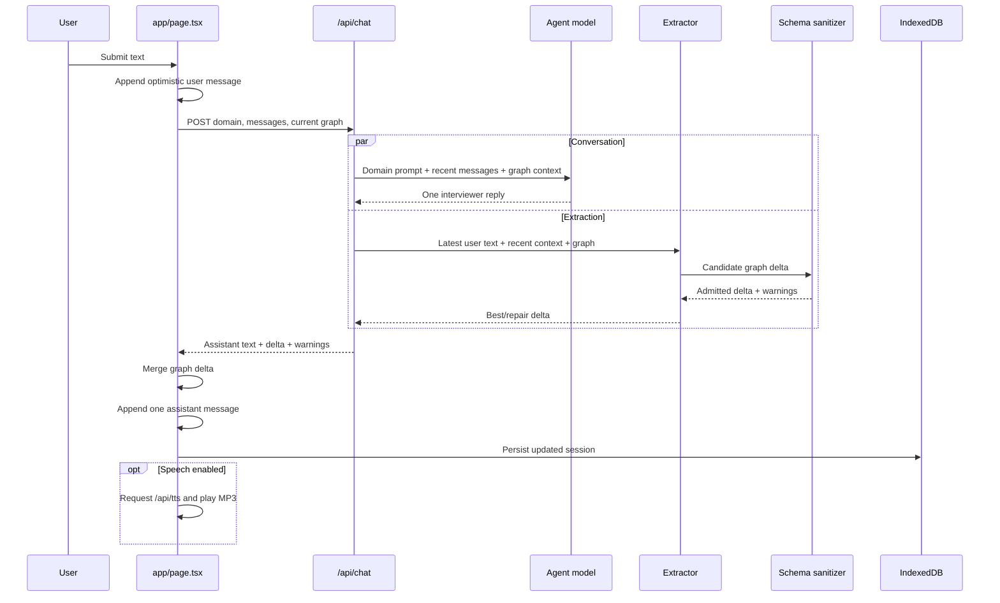
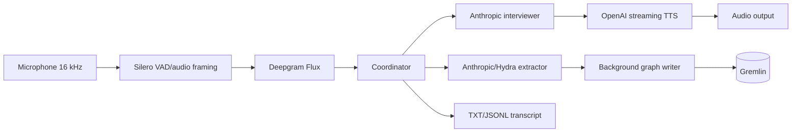

# In-Depth Architecture

**Repository:** Chatgraph V2  
**Path:** `/workspaces/Chatgraph-V2`  
**Architecture snapshot:** 2026-07-21  
**Purpose:** authoritative engineering, research, and handoff guide for continuing this repository without losing runtime, schema, provenance, or evaluation context.

> This document distinguishes facts observed in code from design intent and research-only behavior. That distinction is essential. The repository contains multiple implementation eras and several overlapping schema/governance artifacts. A future editor should never assume that a specification file is enforced by the browser application simply because both exist in the same repository.

## 1. Executive Summary

Chatgraph is a conversational knowledge-elicitation system. A user speaks or types natural-language answers, an AI interviewer asks the next question, and a second extraction path converts user statements into a typed property graph. The browser shows the conversation and graph side by side and persists each domain session in IndexedDB.

There are two supported domains:

1. **Medical/headache interview:** a cautious, non-diagnostic symptom interview that extracts a graph of headache attributes, symptoms, triggers, relief strategies, history, and red flags.
2. **Hospitality expert interview:** a structured expert-knowledge interview intended to capture principles, standards, signals, personas, policies, heuristics, decision rules, recovery actions, loyalty drivers, constraints, outcomes, transcript episodes, and provenance.

The repository has three major systems:

| System | Status | Main technology | What it does |
|---|---|---|---|
| Browser application | Active product runtime | Next.js 15, React 19, TypeScript, OpenAI APIs | Text and realtime voice conversation, extraction, graph display, local persistence, exports |
| Local voice/Gremlin application | Separate companion/earlier runtime | Python 3.12, Anthropic, Deepgram, OpenAI TTS, HydraPop, Gremlin | Local microphone interview, streaming orchestration, typed extraction, transcript files, optional graph database writes |
| NeSy evaluation pipeline | Offline research runtime | Node.js scripts, OpenAI API caches, deterministic validators | Runs and reconstructs A0-A5 ablations, computes metrics, builds audit materials, validates research artifacts |

The active browser application does **not** invoke the Python package, HydraPop, Deepgram, or Gremlin. The research scripts do **not** drive the live UI. The hospitality JSON specifications are richer than what the active application currently enforces.

The most important architectural truth is therefore:

> Chatgraph currently has one live conversational UI, one separate advanced local voice runtime, and one offline governance experiment. They share concepts and schemas, but they do not share one generated contract or one execution path.

## 2. Source-of-Truth Hierarchy

When files disagree, use the following hierarchy for understanding current behavior:

1. **Active browser behavior:** `app/`, `components/`, and `lib/`.
2. **Runtime graph contracts:** `src/main/json/medical.json` and `src/main/json/hospitality.json` as parsed by `lib/schema.ts`.
3. **Offline research behavior:** `scripts/nesy_results/` plus the frozen inputs under `results/config/`.
4. **Python runtime behavior:** `src/main/python/chatgraph/` and `pyproject.toml`.
5. **Hospitality design/governance intent:** files under `hopitality files/`.
6. **Historical explanation:** `README.md`, `TECHNICAL_ARCHITECTURE_DEEP_DIVE.md`, `CHAT_CONTEXT_HANDOFF.md`, and the paper/prompt documents.

This hierarchy is not a quality ranking. It answers only, "what code actually runs?" Design specs may be conceptually better than the current implementation, but they are not active until code imports or reproduces them.

## 3. Repository Map

### 3.1 Active Next.js application

| Path | Responsibility |
|---|---|
| `app/page.tsx` | Main client UI, session state, text/voice orchestration, graph merge, persistence, controls, reset, and export |
| `app/layout.tsx` | Next.js root layout and document metadata |
| `app/globals.css` | Full application styling and responsive layout |
| `app/api/chat/route.ts` | Text-mode agent response and graph extraction in parallel |
| `app/api/extract/route.ts` | Extraction-only endpoint used by realtime voice transcripts |
| `app/api/realtime/token/route.ts` | Creates an ephemeral OpenAI Realtime session secret |
| `app/api/tts/route.ts` | Server-side OpenAI text-to-speech proxy for non-Realtime speech |
| `components/GraphView.tsx` | D3 force layout and custom SVG graph renderer |
| `lib/domains.ts` | Domain registry: IDs, labels, schemas, opening lines, prompts, root graph, and display filters |
| `lib/prompts.ts` | Medical interviewer and extractor prompt text |
| `lib/realtime.ts` | WebRTC Realtime client and turn/cancellation/de-duplication state machine |
| `lib/server/extract.ts` | Medical OpenAI extraction plus repair; hospitality deterministic fallback extraction |
| `lib/schema.ts` | Runtime schema parser, graph summary, delta sanitizer, and graph merge |
| `lib/storage.ts` | IndexedDB session storage |
| `lib/speech.ts` | Browser SpeechRecognition fallback and HTML-audio TTS client |
| `lib/export.ts` | TXT, JSONL, and complete-session JSON serializers |
| `lib/types.ts` | Shared domain, message, graph, delta, session, and schema types |
| `src/main/json/*.json` | Runtime Hydra-style schema JSON consumed by TypeScript |

### 3.2 Hospitality specification and governance material

The directory name is misspelled as `hopitality files/`. Preserve that exact path until a coordinated rename updates all references.

| Path | Responsibility |
|---|---|
| `hopitality files/prompt Hospitality .txt` | Long-form hospitality interview prompt/source text |
| `hopitality files/prompt Hospitality .docx` | Document version of the hospitality prompt |
| `hopitality files/schema hospitality.json` | Design/source copy of the hospitality schema; currently not byte-identical to runtime schema |
| `hopitality files/section map.json` | Section A-G goals, expected concepts, edge patterns, and ID conventions |
| `hopitality files/provenance spec.json` | Evidence-binding policy and provenance validation definitions |
| `hopitality files/validation rules.json` | Delta/session hard, soft, and advisory governance checks |
| `hopitality files/ingestion config.json` | Intended validation and graph-ingestion lifecycle |
| `hopitality files/documentation (1).md` | Supporting schema/process documentation |

### 3.3 Python/HydraPop runtime

| Path | Responsibility |
|---|---|
| `pyproject.toml` | Python package, dependencies, test paths, and CLI entry points |
| `src/main/python/chatgraph/chat/main.py` | Local voice coordinator and lifecycle |
| `chat/agent.py` | Anthropic streaming interviewer |
| `chat/extractor.py` | Anthropic/Hydra typed graph extraction with retry |
| `chat/validation.py` | Delta-aware graph validation |
| `chat/stt.py` | Deepgram Flux streaming transcription and turn events |
| `chat/tts.py` | OpenAI streaming TTS worker |
| `chat/audio.py` | Microphone/output audio and VAD support |
| `chat/transcript.py` | Durable TXT/JSONL transcript writing |
| `chat/graph_writer.py` | Optional asynchronous Gremlin writer |
| `domains/*` | Domain-specific prompts and schema builders |
| `schema/build.py` | Schema generation entry point |
| `src/test/python/chatgraph/test_extractor_smoke.py` | Mocked extractor smoke test |
| `config/gremlin/*` | Local TinkerGraph Gremlin Server configuration |

### 3.4 Evaluation and paper-support runtime

| Path | Responsibility |
|---|---|
| `data/session/chatgraph-20260716-203203.json` | Evaluated hospitality transcript/session corpus |
| `scripts/nesy_results/run_real_ablation.mjs` | Original A0-A5 API ablation runner |
| `scripts/nesy_results/recover_measured_results.mjs` | Cache recovery, repaired gate replay, metrics, tables, audit regeneration |
| `scripts/nesy_results/judge_recovered_a0.mjs` | Grounding-judge runner for a selected condition |
| `scripts/nesy_results/ingest_human_audit.mjs` | Human labels, adjudication, EF, and kappa ingestion |
| `scripts/nesy_results/validate_results.mjs` | Artifact and arithmetic integrity checks |
| `results/raw/*.jsonl` | Per-turn records for each experimental condition |
| `results/metrics.json` | Machine-readable aggregate results |
| `results/results.md` | Main measured-results narrative |
| `results/table1.md` | Paper-ready result table |
| `results/number_map.md` | Mapping from manuscript claims to measured artifacts |
| `results/evidence_manifest.json` | Evidence/provenance map for generated result artifacts |
| `results/audit_key.json` | Hidden condition mapping for audit rows |
| `results/human_audit_*` | Blinded audit sample and annotation templates/metrics |
| `results/config/*` | Frozen extractor, thresholds, judge prompt, and source-spec snapshot |
| `results/cache/real-ablation/*` | Cached provider requests/responses and judge evidence |

### 3.5 Documents and project metadata

| Path | Responsibility |
|---|---|
| `README.md` | Setup and current high-level usage |
| `TECHNICAL_ARCHITECTURE_DEEP_DIVE.md` | Earlier technical deep dive |
| `CHAT_CONTEXT_HANDOFF.md` | Prior chat/editor handoff |
| `CLAUDE.md` | Editor/agent instructions or context |
| `CODEX_PROMPT_FINAL.md` | Research task brief; reference material, not runtime policy |
| `CODEX_FOLLOWUP.md` | Follow-up research task brief |
| `NeSy2026_Paper_DRAFT_LaTeX_preview.md` | Current paper draft preview |
| `package.json` | Next.js and result-pipeline commands |
| `pyrightconfig.json` | Python static-analysis settings |
| `.env` | Local secrets and model configuration; never publish or quote values |

## 4. System Context

```mermaid
flowchart LR
    U[User] --> UI[Next.js browser UI]
    UI --> CHAT[/api/chat]
    UI --> EXT[/api/extract]
    UI --> RTOKEN[/api/realtime/token]
    UI --> TTS[/api/tts]
    CHAT --> OA[OpenAI API]
    EXT --> OA
    RTOKEN --> OA
    TTS --> OA
    UI --> IDB[(IndexedDB)]
    UI --> SVG[GraphView SVG]

    PY[Python local CLI] --> AN[Anthropic API]
    PY --> DG[Deepgram Flux]
    PY --> OA
    PY --> GREMLIN[(Optional Gremlin/TinkerGraph)]

    CORPUS[Hospitality session corpus] --> ABL[Ablation scripts]
    ABL --> OA
    ABL --> CACHE[(Results cache)]
    CACHE --> RES[Results and audit artifacts]
```

Trust boundaries:

- Browser code is untrusted input territory. API routes receive user-controlled JSON.
- API routes hold provider credentials and are the server-side trust boundary.
- User utterances and conversation context are sent to configured model providers.
- Browser sessions live locally in IndexedDB, not in a server database.
- The Python runtime may persist transcript files and write to Gremlin.
- Research caches may contain full prompts, transcript material, and provider output. Treat them as sensitive research data.

## 5. Active Browser Application

### 5.1 UI composition

The first screen is the actual application, not a marketing page. It has:

- Header with product/domain context.
- Domain selector for medical or hospitality.
- Realtime voice toggle/control.
- Speaker/TTS control.
- Microphone control for browser speech recognition.
- Export control.
- Reset control.
- Scrollable alternating transcript.
- Text input and send command.
- Graph summary and force-directed graph panel.

`app/page.tsx` is currently both the presentation container and the orchestration layer. It owns most mutable state and callbacks. This keeps the prototype direct but makes concurrency behavior hard to reason about because conversation, audio, extraction, persistence, and graph update logic share one component.

### 5.2 Session model

The TypeScript model in `lib/types.ts` has this conceptual shape:

```ts
type DomainId = "medical" | "hospitality";

type ChatMessage = {
  id: string;
  role: "user" | "assistant";
  text: string;
  createdAt: string;
};

type GraphVertex = {
  id: string;
  label: string;
  properties: Record<string, unknown>;
};

type GraphEdge = {
  id: string;
  label: string;
  out: string;
  in: string;
  properties: Record<string, unknown>;
};

type GraphState = {
  vertices: Record<string, GraphVertex>;
  edges: Record<string, GraphEdge>;
};

type GraphDelta = {
  vertices: GraphVertex[];
  edges: GraphEdge[];
};
```

The actual file should be consulted before changing serialized contracts, but these are the core semantics:

- Vertex and edge IDs are globally unique within a session.
- Graph state is normalized into object maps keyed by ID.
- API extraction produces arrays as a delta.
- Merging is an upsert, not a replacement.
- Messages are ordered append-only UI records.
- Each domain gets a separate local session.

### 5.3 Domain registry

`lib/domains.ts` is the active domain switchboard. A domain definition supplies:

- Human-readable name and subtitle.
- User role label and input placeholder.
- Opening assistant message.
- Agent system prompt.
- Extractor system prompt.
- Parsed runtime schema source.
- Initial/root graph.
- Graph display filters for hidden labels and edges.

Adding a domain therefore requires more than adding a selector option. It requires a schema, prompts, opening state, role vocabulary, root graph policy, extraction implementation, display policy, and tests.

## 6. Text Conversation Flow

### 6.1 End-to-end sequence



### 6.2 Client behavior

On text submit, `app/page.tsx`:

1. Rejects blank input or another in-flight send.
2. Interrupts current fallback speech so the user can take the floor.
3. Creates and appends a user message optimistically.
4. Sends the domain, accumulated messages, and current graph to `/api/chat`.
5. Receives one assistant response and one graph delta.
6. Merges admitted vertices and edges into the client graph.
7. Appends exactly one assistant message.
8. Persists the new session to IndexedDB.
9. Optionally sends assistant text through `/api/tts`.
10. Surfaces non-fatal extraction warnings separately from fatal chat errors.

The UI send lock prevents overlapping **text** submissions. It does not establish a global ordering protocol across text, realtime, extraction, reset, and domain switching.

### 6.3 `/api/chat` contract

Request conceptually contains:

```json
{
  "domain": "medical",
  "messages": [{ "role": "user", "text": "..." }],
  "graph": { "vertices": {}, "edges": {} }
}
```

Response conceptually contains:

```json
{
  "assistant": "One conversational response",
  "delta": { "vertices": [], "edges": [] },
  "warnings": []
}
```

The route:

- Requires `OPENAI_API_KEY`.
- Validates basic message and graph shape.
- Takes the latest user message as the extraction target.
- Runs interviewer generation and extraction concurrently with `Promise.allSettled`.
- Uses the first user message plus approximately the latest 14 messages for agent context.
- Defaults the conversational model to `gpt-4o`, overridable by `CHATGRAPH_AGENT_MODEL`.
- Caps the agent response at 420 completion tokens.
- Returns a server error if the interviewer fails.
- Keeps the conversation alive if extraction fails by returning an empty delta and warning.

This failure policy is deliberate: graph enrichment is secondary to preserving a usable conversation.

## 7. Realtime Voice Flow

### 7.1 Transport and model session

`lib/realtime.ts` establishes a WebRTC connection directly from the browser to OpenAI using a short-lived secret obtained from `/api/realtime/token`. The permanent project API key remains server-side.

The token route configures, by default:

- Realtime model: `gpt-realtime-2` or `CHATGRAPH_REALTIME_MODEL`.
- Voice: `marin` or `CHATGRAPH_REALTIME_VOICE`.
- Input transcription: `gpt-realtime-whisper`.
- Turn detection: semantic VAD.
- Audio output enabled.
- Domain-specific interviewer instructions.
- An explicit instruction that the opening line is handled separately and the Realtime model must remain silent until a user transcript exists.

### 7.2 Why realtime has a separate extraction route

In text mode, `/api/chat` creates both the assistant reply and graph delta. In realtime mode, OpenAI Realtime creates and voices the reply itself. Calling `/api/chat` would create a second assistant reply. Realtime therefore uses:

- Realtime WebRTC for the assistant turn.
- `/api/extract` only for graph extraction from completed user transcripts.

This split is central to the earlier duplicate-dialogue bug and its mitigation.

### 7.3 Event/state machine

The Realtime wrapper tracks:

- Whether a response is in flight.
- How many user turns are awaiting an assistant response.
- Whether another response must be created after the current response settles.
- Partial assistant transcript text.
- Buffered user transcript fragments.
- Response-settle deadline.
- Recently emitted normalized assistant text for short-window de-duplication.

Expected lifecycle:

```text
disconnected
  -> fetch ephemeral token
  -> create RTCPeerConnection and data channel
  -> attach microphone track
  -> connected/listening
  -> receive final input transcript fragment(s)
  -> buffer fragments for ~700 ms
  -> emit one user turn to page
  -> increment pending assistant turns
  -> create exactly one response when allowed
  -> collect assistant transcript/audio deltas
  -> emit assistant message only after response.done
  -> clear in-flight state
  -> create next queued response only if another user turn arrived
```

### 7.4 Duplicate-dialogue safeguards

The current implementation contains several coordinated guards:

1. **Opening isolation:** the browser speaks the initial assistant greeting separately. During that period, Realtime responses are blocked and the microphone is muted.
2. **Pending-turn accounting:** an assistant response is requested only when there is a known user turn awaiting a reply.
3. **Unexpected response cancellation:** unsolicited or overlapping `response.created` events are cancelled.
4. **Barge-in handling:** a new final user transcript cancels an in-flight response and clears its partial transcript.
5. **Completion-only transcript commit:** assistant transcript is accumulated from deltas but added to the UI only when `response.done` arrives.
6. **Normalized duplicate suppression:** identical assistant text emitted within roughly two seconds is ignored.
7. **Response settling:** the wrapper waits for cancellation/completion to settle before creating a deferred response.

These defenses directly address the observed failure where one AI utterance stopped and another began, while the transcript showed two consecutive assistant turns.

### 7.5 Realtime limitations

- Response state is heuristic and client-local; it is not a durable per-turn transaction log.
- The two-second normalized-text guard can suppress a legitimate repeated sentence or miss a delayed duplicate.
- The 700 ms user-fragment window can split slow transcript fragments or combine adjacent speech.
- Assistant transcript identity is not persisted with provider response/item IDs.
- Extraction requests can finish out of order because completed voice turns are not serialized through a single graph-update queue.
- The assistant model and graph extractor see related but not identical state and may interpret an utterance differently.
- Reconnect behavior does not constitute server-side conversation recovery.

## 8. Browser Speech and TTS Fallbacks

`lib/speech.ts` supports browsers that expose `SpeechRecognition`/`webkitSpeechRecognition`. This path captures a one-shot transcript and submits it through the normal text pipeline. It is distinct from Realtime WebRTC.

`/api/tts` calls OpenAI TTS with:

- Model `tts-1`.
- Voice `nova` unless overridden by `CHATGRAPH_TTS_VOICE`.
- MP3 output.
- Speed `1.0`.

The browser plays the returned audio through an HTML audio element. Starting a new user turn interrupts current playback. This mode has no word-level synchronization with the transcript.

## 9. Conversation Design and Prompting

### 9.1 Medical interviewer

The medical prompt in `lib/prompts.ts` instructs the agent to:

- Conduct a cautious headache-focused interview.
- Avoid diagnosing or claiming medical certainty.
- Ask one concept or question at a time.
- Use short, plain-language replies.
- Acknowledge what was heard before moving forward.
- Recognize concerning red flags and recommend urgent care where appropriate.
- Gather structured details useful to the graph.

The prompt reduces multi-question overload, but model behavior still requires tests. The screenshots that motivated earlier fixes showed repeated or closely overlapping questions, especially after noisy/partial voice input.

### 9.2 Hospitality interviewer

The hospitality agent identifies as a knowledge elicitor (Cognisee) and follows a staged A-G protocol:

| Section | Goal | Typical knowledge |
|---|---|---|
| A | Introduction, profile, success framing, interview preferences | Role, business, tenure, goals |
| B | Guest-experience foundations | Principles, signals, personas, service standards |
| C | Arrival/departure operations | Check-in/out policy, timing rules |
| D | Failure and recovery | Service failures, recovery actions, exceptions, flexibility |
| E | Judgment and expert reasoning | Decision rules and operating heuristics |
| F | Psychology and loyalty | Emotional moments and loyalty drivers |
| G | Context and systems | Constraints, outcomes, interactions, closure |

At section boundaries the interviewer should ask whether to go deeper and obtain permission before moving on. At closure it should summarize learned knowledge and invite correction.

The live prompt defines this flow, but the active deterministic hospitality extractor does not maintain a real A-G section state machine. It currently assigns a simplistic introduction/section-1 structure for substantive turns.

### 9.3 Extractor prompting principles

The shared extraction framing distinguishes:

- **Infrastructure vertices:** person, session, section, transcript episode, provenance evidence.
- **Knowledge vertices:** claims, rules, standards, concepts, outcomes, and domain facts.
- **Semantic edges:** relationships between knowledge vertices.
- **Provenance edges:** links from knowledge claims to evidence.

Desired behavior is conservative: reuse stable entities, represent the speaker's actual claim, avoid generic placeholder values, connect all new edges to valid endpoints, and return only the incremental delta.

Prompt duplication exists across TypeScript, Python, text, DOCX, section maps, and frozen research configurations. There is no build step proving they remain equivalent.

## 10. Graph Data Contract

### 10.1 Property graph semantics

A graph consists of typed vertices and directed typed edges:

```text
(out vertex) -[edge label]-> (in vertex)
```

Example medical facts:

```text
Person -[reports]-> Headache
Headache -[locatedAt]-> BodyLocation(value="forehead")
Headache -[hasFrequency]-> Frequency(value="twice a week")
Headache -[hasQuality]-> Quality(value="sharp, needle-like")
Headache -[hasDuration]-> Duration(value="12 hours")
```

The value belongs on the target value vertex. A `Frequency` vertex whose visible value is merely `"Frequency"` is semantically empty even if its label is schema-valid. The same applies to generic `PainCharacter`, `Duration`, `Quality`, or `Outcome` nodes.

### 10.2 Runtime schema JSON shape

Schemas use Hydra-style keyed entries:

```json
{
  "vertices": [
    {
      "@key": "Frequency",
      "@value": {
        "label": "Frequency",
        "id": { "string": {} },
        "properties": [
          { "key": "value", "value": { "string": {} }, "required": true }
        ]
      }
    }
  ],
  "edges": [
    {
      "@key": "hasFrequency",
      "@value": {
        "label": "hasFrequency",
        "out": "Headache",
        "in": "Frequency",
        "properties": []
      }
    }
  ]
}
```

`lib/schema.ts` parses this into cached maps of vertex specs and edge specs.

### 10.3 Sanitization

`sanitizeDelta` performs admission checks before merge:

- Input delta must contain arrays.
- Vertex ID and label must be non-empty strings.
- Vertex label must exist in the selected schema.
- Unknown properties are removed.
- Required vertex properties must be present.
- Edge ID, label, `out`, and `in` must be valid strings.
- Edge label must exist in the schema.
- Both endpoints must resolve to accepted-delta vertices or existing graph vertices.
- Endpoint labels must match the edge's declared `out` and `in` labels.
- Unknown edge properties are removed.
- Required edge properties must be present.
- Rejected material produces warnings rather than being silently merged.

The active parser supports one `out` label and one `in` label per edge type. It cannot directly enforce a polymorphic endpoint declaration such as `out_any_of`.

### 10.4 Merge semantics

`mergeDelta`:

- Upserts vertices by ID.
- Upserts edges by ID.
- Shallow-merges properties when an ID already exists.
- Leaves unrelated existing graph objects in place.

It does not:

- Delete or retract claims.
- Resolve contradictory values.
- preserve a property-level history.
- Store model/prompt/version metadata.
- Enforce temporal ordering.
- Perform ontology-level entity resolution.
- Prevent two different IDs from representing the same real concept.
- Run a transaction spanning transcript, extraction, and persistence.

## 11. Medical Schema

The active medical schema contains 77 vertex types and 158 edge types. Its purpose is symptom elicitation and graph structuring, not clinical diagnosis.

### 11.1 Major vertex families

| Family | Representative types | Purpose |
|---|---|---|
| Core | `Person`, `Headache`, `HeadacheClassification` | Interview subject and headache episode/concept |
| Temporal phases | `Prodrome`, `Aura`, `Postdrome` | Before/during/after phase structure |
| Pain | `PainCharacter`, `BodyLocation`, `Quality`, `Severity`, `Laterality`, `Frequency`, `Duration` | Location, sensation, intensity, side, recurrence, length |
| Associated symptoms | Nausea, vomiting, light/sound/smell sensitivity and other symptom flags | Clinical phenomenology |
| Aura details | Visual, sensory, language, motor, brainstem, retinal subtypes | Typed aura descriptions |
| Triggers | General trigger bucket and typed trigger values | Sleep, stress, food, environment, hormonal/context triggers |
| Relief | General relief bucket and typed relief values | Medication, rest, darkness, hydration, physical/behavioral relief |
| Impact | Activity, work, school, sleep, disability-related types | Functional consequences |
| History | Onset, age, family history, prior episodes, trends | Longitudinal context |
| Risk/red flags | Syncope and other concerning-event types | Safety escalation cues |
| Comorbidity/diagnosis | Medical history and prior diagnostic concepts | Context, without creating a diagnosis in conversation |
| Escape hatch | `Comment`, `Concept` | Less structured facts that do not fit typed schema |

Value-like nodes such as `BodyLocation`, `Quality`, `Severity`, `Laterality`, `Frequency`, `Duration`, and `Age` require a meaningful `value` property. Their UI label should display that value rather than the ontology class name.

### 11.2 Relationship families

The 158 edge definitions include:

- Subject: `Person -> Headache` through `reports`.
- Classification and phases: headache to classification/prodrome/aura/postdrome.
- Characterization: `locatedAt`, `hasQuality`, `hasPainCharacter`, `hasSeverity`, `hasLaterality`, `hasFrequency`, `hasDuration`.
- Symptoms and aura: headache/phase to typed manifestations.
- Causation/context: triggers, aggravated-by, associated-with.
- Relief: relieved-by and subtype-specific relief relationships.
- History and impact: onset, age, impairment, prior diagnoses, family history.
- Escape-hatch relationships for `Concept` and `Comment`.

The exact endpoint contract is the JSON file, not this grouped description.

### 11.3 Medical extraction path

`lib/server/extract.ts` uses OpenAI tool calling for medical extraction:

1. Build the selected schema reference and a bounded graph summary.
2. Provide recent conversation context and the current user utterance.
3. Ask the extractor model for a graph delta through a function/tool schema.
4. Parse and sanitize the candidate.
5. Retry up to three attempts with validation warnings for repair.
6. Keep the best candidate by a simple score favoring admitted graph objects and fewer warnings.
7. Apply deterministic medical repairs for high-value attributes.

Default extractor model is `gpt-4o-mini`, overridable with `CHATGRAPH_EXTRACTOR_MODEL`.

### 11.4 Deterministic medical repair

The repair layer was added to stop generic ontology-name nodes from replacing actual user values. It extracts or repairs:

- Location, such as forehead or between eyebrows.
- Duration, including numeric hours.
- Frequency, including "twice" interpreted from recent question context.
- Quality, including sharp and needle-like descriptions.

It also:

- Removes empty or generic `PainCharacter` nodes.
- Creates/reuses the headache root when required.
- Creates the person's `reports` relationship where needed.
- Uses deterministic IDs so repeated facts update rather than multiply where possible.

The intended result is:

```text
Headache -[hasFrequency]-> Frequency(value="twice a week")
Headache -[hasQuality]-> Quality(value="sharp, needle-like")
```

instead of:

```text
Headache -[hasFrequency]-> Frequency(value="Frequency")
Headache -[hasPainCharacter]-> PainCharacter(value="PainCharacter")
```

Current caveat: when deterministic support adds facts, warning handling can obscure warnings for unrelated LLM candidate objects. The repair and warning channels should be separated in a future refactor.

## 12. Hospitality Schema

The active hospitality runtime schema has 24 vertex types and 32 edge types.

### 12.1 Infrastructure vertices

| Vertex | Required properties | Meaning |
|---|---|---|
| `Person` | none | Interviewed expert/person |
| `KnowledgeSession` | `domain` | Session root and metadata |
| `SessionSection` | `sectionType`, `order` | A-G conversation segment |
| `TranscriptEpisode` | `verbatimText` | Source utterance/episode |
| `ProvenanceEvidence` | `traceText`, `sourceEpisode`, `speaker` | Evidence record that justifies a knowledge claim |

### 12.2 Knowledge vertices

| Vertex | Required property | Meaning |
|---|---|---|
| `ExpertRole` | `title` | Expert's role |
| `HospitalityBusiness` | `name` | Business identity/type/scale |
| `OperatingTenure` | `duration` | Time operating or in role |
| `GuestExperiencePrinciple` | `name` | High-level experience belief |
| `ServiceStandard` | `name` | Operational service standard |
| `GuestSignal` | `name` | Observable cue from a guest |
| `GuestPersona` | `name` | Guest segment/persona |
| `CheckInPolicy` | schema-defined policy fields | Arrival policy |
| `CheckOutPolicy` | schema-defined policy fields | Departure policy |
| `TimingRule` | `ruleText` | Time-sensitive operational rule |
| `ServiceFailure` | `name` | Failure pattern |
| `RecoveryAction` | `name` | Corrective action |
| `ExceptionRule` | `ruleText` | Rule for deviating from standard process |
| `DecisionRule` | `ruleText` | If/when/unless/action expert decision logic |
| `OperatingHeuristic` | `name` | Practical expert shortcut or judgment pattern |
| `LoyaltyDriver` | `name` | Cause of repeat preference/loyalty |
| `EmotionalMoment` | `name` | Emotionally important part of experience |
| `ContextualConstraint` | none in current runtime schema | Constraint affecting a policy or decision |
| `Outcome` | none in current runtime schema | Result of a policy/action/rule |

The absence of required properties for `ContextualConstraint` and `Outcome` permits structurally valid but semantically empty nodes. Governance should add required meaningful text properties.

### 12.3 Hospitality edge inventory

The 32 relationships cover:

| Area | Edges |
|---|---|
| Session ownership | `hasSession`, `hasRole`, `operatesBusiness`, `hasOperatingTenure`, `hasSection`, `hasEpisode` |
| Episode topics | the schema's `discusses*` relationships from episodes to knowledge classes |
| Guest design | `experienceDesignedFor`, `businessDifferentiatedBy`, `standardDeliveredTo`, `enforces` |
| Signals and actions | `signalTriggers`, `signalIndicates` |
| Policy | `governs`, `governsCheckOut` |
| Failure/recovery | `resolvedBy`, exception-related edges, `recoveryLeadsTo` |
| Reasoning | `heuristicExplains`, `leadsTo` |
| Loyalty/emotion | `shapesLoyalty`, `drivenBy`, `loyaltyLeadsTo` |
| Context | `modulatedBy`, `constraintAffectsPolicy` |
| Provenance | `principleSupportedBy`, `heuristicSupportedBy`, `supportedBy` |

Consult `src/main/json/hospitality.json` for exact direction and endpoint labels. Some governance documents assume polymorphic provenance endpoints that the active runtime schema and parser cannot represent.

### 12.4 Hospitality active extraction path

The browser's hospitality branch currently returns `hospitalityFallbackDelta` immediately. It is deterministic heuristic extraction, not the research ablation extractor and not an OpenAI tool call.

For a substantive turn it may create:

- A `SessionSection`.
- A `TranscriptEpisode` containing the utterance.
- A `ProvenanceEvidence` object.
- Profile concepts such as role, business, and tenure.
- Generic principles/personas/business concepts.
- Keyword-triggered decision rules, outcomes, or service standards.
- Semantic and provenance edges.

Important limitations:

- Short or filler utterances are ignored.
- Section assignment is largely hard-coded to introduction/section 1.
- The A-G section map is not followed turn by turn.
- Concepts are inferred by regex/keywords and can be overly generic.
- Profile extraction returns early and may omit expected provenance bindings.
- The hospitality fallback is returned without passing through the same `sanitizeDelta` path used for medical model output.
- It does not execute the 25-rule governance suite.
- It is therefore inappropriate to describe the live hospitality graph as fully governed or research-equivalent.

## 13. Provenance, Grounding, and Governance

### 13.1 Provenance model

The intended provenance chain is:

```text
KnowledgeSession -[hasSection]-> SessionSection
SessionSection -[hasEpisode]-> TranscriptEpisode
TranscriptEpisode -[discussesX]-> KnowledgeVertex
KnowledgeVertex -[supportedBy/principleSupportedBy/heuristicSupportedBy]-> ProvenanceEvidence
ProvenanceEvidence.sourceEpisode -> TranscriptEpisode.id
```

`ProvenanceEvidence` records:

- `traceText`: the source language or precise evidence trace.
- `sourceEpisode`: ID of the transcript episode.
- `speaker`: one of expert/interviewer/system under governance rules.
- Optional timestamp.
- Optional confidence: high, medium, low, or inferred.

For newly stated evidence, a knowledge node should have a corresponding evidence binding. Reused singleton nodes should receive additional evidence when a later utterance adds or changes a claim.

### 13.2 Evidence reuse and inference

The provenance specification intends:

- Reuse one evidence node within an episode when several facts share the same justification.
- Split evidence when facts rely on materially different parts of the utterance.
- Create new evidence when a later episode adds support to an existing knowledge node.
- Mark synthesis as `inferred` only when it is based on at least two episodes.
- Cite the contributing episodes in `traceText` for inferred claims.

### 13.3 Provenance edge mapping

The repaired governance map treats:

- `GuestExperiencePrinciple` via `principleSupportedBy`.
- `TimingRule` and `OperatingHeuristic` via `heuristicSupportedBy`.
- Other knowledge classes, including `ExpertRole`, `HospitalityBusiness`, and `OperatingTenure`, via `supportedBy`.

This map repairs a real experimental mismatch: the three profile classes were originally omitted even though they are expert-asserted knowledge.

### 13.4 Validation levels

`hopitality files/validation rules.json` contains 25 rules grouped by scope and severity.

Delta hard rules include:

- Required properties.
- Allowed vertex/edge labels.
- Endpoint type correctness.
- Endpoint existence and no dangling edges.
- Required session root/singletons.
- Allowed speaker and confidence vocabulary.
- Non-generic provenance text.
- Minimum content quality for decision and timing/heuristic rules.

Delta soft rules include:

- Every knowledge node has provenance.
- Correct provenance edge type.
- Inferred claims cite multiple episodes.

Session-level rules include:

- Expected section coverage.
- Duplicate persona/signal checks.
- Singleton count checks.
- Source-episode integrity.

Advisory checks include:

- Failures connect to recovery.
- Decision rules are semantically connected.
- Loyalty concepts connect to causes/outcomes.
- Minimum knowledge coverage.

### 13.5 Hard-versus-soft tension

The provenance spec's normal operational posture is warn-and-continue for some provenance failures. The research A4/A5 conditions intentionally turn provenance into a hard admission gate. These are condition-specific policies, not evidence that the source documents are consistent by default.

### 13.6 Grounding metrics

The evaluation pipeline distinguishes several failure types:

- **OC (Ontology Compliance):** admitted fact uses allowed typed structure.
- **SH (Subject Hallucination):** edge subject is not grounded in source/context.
- **RH (Relation Hallucination):** relation itself is unsupported.
- **OH (Object Hallucination):** edge object is unsupported.
- **Provenance coverage:** admitted knowledge vertices linked to evidence under the contract.
- **EF (Evidence Faithfulness):** human-judged faithfulness; currently unmeasured pending completed annotations.
- **Yield:** admitted facts divided by proposed facts.
- **Cost/latency per admitted fact:** only meaningful with a nonzero admitted denominator.

Ontology validity is not the same as evidence validity. A graph can be perfectly schema-shaped and poorly grounded.

## 14. Schema and Governance Drift

This is the highest-priority architectural debt.

1. `src/main/json/hospitality.json` and `hopitality files/schema hospitality.json` are not identical.
2. The active schema parser permits one endpoint label per side, while governance expects some provenance edges to originate from multiple knowledge labels.
3. The repaired research provenance map includes profile classes not consistently handled by the live fallback.
4. `section map.json` contains older concepts such as `appliesToPersona`, while runtime uses `experienceDesignedFor`.
5. Historical section-A guidance and the current profile-rich opening behavior differ.
6. Validation rules exist as JSON but are independently reimplemented in research scripts and are not executed in the live UI.
7. Prompts and schema references are duplicated across TypeScript, Python, source documents, and frozen experiment files.

Recommended target architecture:

```text
canonical schema + canonical governance spec
            |
            +--> generated TypeScript runtime maps/types
            +--> generated Python/Hydra schema
            +--> generated extractor tool schema
            +--> generated provenance endpoint map
            +--> generated validator fixtures
            +--> frozen experiment snapshot with hash
```

Until that exists, every schema change requires a manual drift audit.

## 15. Graph Rendering

`components/GraphView.tsx` performs these steps:

1. Filter hidden infrastructure/provenance labels and edges according to the selected domain.
2. Convert normalized graph maps into render nodes/links.
3. Derive visible labels from meaningful properties, preferring `value`, `name`, `title`, and `duration` before special fallbacks.
4. Initialize node positions.
5. Run D3 force simulation with link, charge, center, and collision forces.
6. Pre-tick the simulation for a settled initial layout.
7. Render custom SVG edges, arrowheads, edge labels, circles, and truncated node labels.
8. Support node dragging, canvas panning, and wheel zoom.

The viewport is based around a fixed 720 x 520 drawing space. Labels are truncated around 12 characters. Edge text appears only above a length threshold to reduce overlap.

Known graph-view limitations:

- Random initial positions cause layout movement across updates.
- Dense graphs have overlapping edge and node labels.
- Hidden provenance makes the main graph readable but prevents provenance inspection.
- There is no node/edge details panel.
- There is no section clustering, semantic filtering UI, search, graph history, or visual diff.
- Position and zoom are not durable session data.
- Large graphs are not virtualized.
- Accessibility for SVG interaction is limited.
- There is no graph image export.

The display filter affects visibility only. Hidden or malformed data may remain in the stored graph and exports.

## 16. Persistence and Export

### 16.1 IndexedDB

`lib/storage.ts` uses:

- Database: `chatgraph-browser`.
- Object store: `sessions`.
- Per-domain key pattern: `default:<domain>`.

At startup or domain switch, the app loads the matching local session. If none exists, it creates domain initial state with the opening message and root graph. Changes are saved back to IndexedDB.

Consequences:

- Data belongs to one browser profile/device.
- There is no user account or remote sync.
- There is no multi-session list; each domain has one default slot.
- Browser storage clearing removes the session.
- No server-side audit trail exists.
- IndexedDB writes are last-write-wins.

### 16.2 Export formats

The application supports:

- Plain transcript text.
- JSONL transcript records.
- Complete session JSON containing domain, messages, settings, and graph.

Known export issue: the JSONL/text speaker label can call the user `patient` even for hospitality. Downstream research should prefer the complete session JSON or fix export labels based on the domain registry.

## 17. Python Voice/Gremlin Runtime

### 17.1 Purpose and execution

The Python package is a local, audio-oriented runtime with stronger streaming and persistence plumbing. It is installed through `pyproject.toml` and exposes:

```bash
chatgraph-build-schema
chatgraph
```

It requires Python 3.12 or newer and packages including Hydra kernel/property graph, Anthropic, Deepgram, OpenAI, sounddevice, NumPy, Torch, Silero VAD, websockets, and gremlinpython.

### 17.2 Voice pipeline



Deepgram Flux emits turn-aware events including `StartOfTurn`, `Update`, `EagerEndOfTurn`, `TurnResumed`, and `EndOfTurn`. The coordinator can speculate after eager end-of-turn and cancel work when speech resumes. This is a more explicit barge-in model than browser SpeechRecognition.

### 17.3 Python agent and extractor

- The interviewer streams from an Anthropic Claude Sonnet model.
- The extractor defaults to a Claude Haiku-class model.
- Hydra schema tooling exposes typed graph operations.
- Extraction retries up to three attempts using validation feedback.
- A rolling conversation context helps resolve short answers.
- Delta validation resolves edge endpoints against both the delta and known live graph labels, avoiding the common error of validating a delta as if it were a complete graph.

### 17.4 Transcript and audio behavior

- Audio uses 16 kHz frames, typically 20 ms.
- OpenAI TTS audio is resampled from 24 kHz to 16 kHz for local playback.
- TTS runs in a worker and can be cancelled on interruption.
- Transcript writer records turns to TXT/JSONL and marks interrupted output.
- Files are flushed per turn for crash resilience.

### 17.5 Gremlin writer

The writer connects by default to `ws://localhost:8182/gremlin`, queues writes in the background, and degrades gracefully if Gremlin is unavailable. It can inspect the whole graph and write vertices before edges.

The included Gremlin Server config:

- Binds to localhost port 8182.
- Uses TinkerGraph.
- Accepts arbitrary/string IDs.
- Registers traversal source `g`.
- Supports GraphSON 3 and GraphBinary.

The TinkerGraph properties shown do not configure a persistent graph location/format. Treat it as in-memory unless persistence is explicitly added and verified.

## 18. Research/Ablation Pipeline

### 18.1 Corpus

The evaluated corpus is one hospitality session:

- 78 transcript messages.
- 45 expert/user turns.
- 32 eligible extraction turns.
- 13 deterministic navigation/filler exclusions.

This is a single-session, single-domain study. It cannot establish broad generalization.

### 18.2 Conditions

| Condition | Extraction/gate behavior |
|---|---|
| A0 | Free-form JSON, no schema gate |
| A1 | Strict tool-shaped output, no admission gate |
| A2 | Schema validation gate |
| A3 | Schema gate plus validation-feedback retry |
| A4 | Schema plus hard provenance admission |
| A4-soft | Provenance failures warn but do not block all material |
| A5 | Full governance condition including additional checks and deterministic-ID policy |

The original experiment uses `gpt-4o-mini`, temperature 0, seed 20260716, with `gpt-4o` as grounding judge where cached verdicts exist.

### 18.3 Fact definition

For metrics, one fact is:

- One knowledge vertex, or
- One edge whose source and target are both knowledge vertices.

Infrastructure vertices and provenance edges are not counted as semantic facts. This definition matters when reconciling raw vertex/edge totals with table denominators.

### 18.4 Recovery pipeline

`recover_measured_results.mjs` exists because raw condition formats and the original A0 parser were not uniform.

It:

- Parses A0 liberally rather than requiring one strict shape.
- Normalizes flat properties.
- Normalizes `source`/`target` into `out`/`in`.
- Handles occasional type-keyed vertex objects.
- Infers labels from emitted property signatures where necessary.
- Replays final cached A4/A5/A4-soft deltas through the repaired provenance endpoint contract.
- Preserves measured A1-A3 data.
- Loads cached grounding-judge verdicts.
- Computes exact counts and Wilson 95% confidence intervals.
- Regenerates result tables, raw records, and blinded audit artifacts.

The replay uses the final cached delta. It cannot reconstruct the counterfactual graph that would have existed if a corrected gate had accepted an earlier retry attempt. Original token, latency, and retry totals are retained.

### 18.5 Current measured results

| Cond. | Proposed/admitted | OC | SH | RH | OH | Provenance | Yield | Seconds/fact |
|---|---:|---:|---:|---:|---:|---:|---:|---:|
| A0 | 62/62 | 55/62 (88.7%) | 3/16 (18.8%) | 0/16 | 3/16 (18.8%) | 1/46 (2.2%) | 100.0% | 2.40 |
| A1 | 67/67 | 63/67 (94.0%) | 1/30 (3.3%) | 0/30 | 3/30 (10.0%) | 2/37 (5.4%) | 100.0% | 1.71 |
| A2 | 40/3 | 3/3 (100%) | 0/1 | 0/1 | 0/1 | 0/2 | 7.5% | 37.11 |
| A3 | 48/29 | 29/29 (100%) | 0/8 | 0/8 | 1/8 (12.5%) | 1/21 (4.8%) | 60.4% | 10.72 |
| A4 | 59/0 | UNMEASURED | UNMEASURED | UNMEASURED | UNMEASURED | UNMEASURED | 0.0% | UNMEASURED |
| A5 | 61/3 | 3/3 (100%) | 0/1 | 0/1 | 0/1 | 2/2 (100%) | 4.9% | 165.72 |
| A4-soft | 69/53 | 53/53 (100%) | 3/28 (10.7%) | 0/28 | 6/28 (21.4%) | 0/25 | 76.8% | 6.66 |

Never convert `UNMEASURED` to zero. A4 has no admitted denominator, so admitted-fact quality and per-admitted-fact cost are undefined.

### 18.6 Cost and retries

| Condition | Tokens/fact | Retry use |
|---|---:|---:|
| A0 | 991 | 0/64 |
| A1 | 1065 | 0/64 |
| A2 | 20314 | 0/64 |
| A3 | 4315 | 25/64 (39.1%) |
| A4 | UNMEASURED | 50/64 (78.1%) |
| A5 | 57692 | 50/64 (78.1%) |
| A4-soft | 2495 | 28/64 (43.8%) |

Proposal counts vary by condition. The experiment therefore changes more than a pure downstream gate: request shape, feedback, retry, and evolving graph state affect proposal volume. Fact-level pairing across conditions is invalid.

### 18.7 Statistical tests and audit

The exact two-sided McNemar tests use 32 paired utterances and the outcome "at least one admitted edge has an unsupported subject or object":

- A0 vs A1: left-only 3, right-only 3, discordant 6, p = 1.
- A3 vs A4: left-only 1, right-only 0, discordant 1, p = 1.
- A0 vs A5: left-only 3, right-only 0, discordant 3, p = 0.25.

The blinded audit has 83 rows:

- A0: 40.
- A1: 40.
- A4: 0.
- A5: 3.

Human annotation fields are blank. EF and Cohen's kappa remain `UNMEASURED` until two independent pre-adjudication files and one adjudicated file are completed and ingested.

### 18.8 Main research interpretation

The measured evidence supports a narrow but important conclusion:

> Typed structure does not automatically produce evidence binding.

A1 has high ontology compliance but very low provenance coverage. A3 reaches 100% ontology compliance among admitted facts while provenance remains under 5%. A4 demonstrates that an overly strict or misaligned provenance gate can collapse useful yield to zero. A4-soft recovers yield but does not create provenance merely by allowing warnings.

### 18.9 Threats to validity

- One transcript and one domain.
- Voice ASR errors can appear as extraction or grounding errors.
- Provider seed behavior is best effort, not deterministic execution.
- Grounding uses a model judge rather than completed human labels.
- A0 recovery infers labels for some nonstandard output shapes.
- Final-delta replay cannot reproduce early-stop state.
- Proposal-count variance confounds pure gate comparison.
- Temporal contradiction checking and downstream QA are unmeasured/out of scope.
- Confidence intervals are wide for low-count conditions.

## 19. Testing and Verification

### 19.1 JavaScript/TypeScript commands

```bash
npm run typecheck
npm run lint
npm run build
npm run test
```

`npm run test` currently runs `scripts/nesy_results/validate_results.mjs`; it is a research-artifact validator, not a UI unit-test suite.

Research commands:

```bash
npm run ablation:real
npm run results:recover
npm run results:judge-a0
npm run results:judge-a5
npm run results:audit
npm run results:finalize
```

Commands that call provider APIs incur cost and transmit transcript content. Use the cache-aware recovery path when fresh calls are unnecessary.

### 19.2 Python commands

With the project installed in a Python 3.12 environment:

```bash
pytest
ruff check .
pyright
```

The existing Python test is a mocked extractor smoke test. It checks a rich medical utterance and validation behavior without requiring a live Anthropic call.

### 19.3 Missing test coverage

The repository lacks comprehensive automated tests for:

- Realtime event reordering, duplicate `response.created`, cancel races, and reconnects.
- Voice transcript fragment buffering.
- Text/voice/domain-switch/reset races.
- Hospitality fallback against every schema-required property and endpoint.
- Deterministic medical repair across paraphrases and negation.
- Graph merge contradiction/retraction behavior.
- IndexedDB migrations and corruption recovery.
- Export role correctness by domain.
- Graph renderer accessibility and dense-layout snapshots.
- API input limits, authorization, rate limiting, and provider timeouts.
- Generated consistency between schema, prompt, validator, and provenance maps.

## 20. Environment and Operations

Environment variable names observed in the project include:

```text
OPENAI_API_KEY
ANTHROPIC_API_KEY
DEEPGRAM_API_KEY
CHATGRAPH_AGENT_MODEL
CHATGRAPH_EXTRACTOR_MODEL
CHATGRAPH_REALTIME_MODEL
CHATGRAPH_REALTIME_VOICE
CHATGRAPH_TTS_VOICE
CHATGRAPH_LOG_LEVEL
HYDRAPOP_HOME
```

Never place values in documentation, logs, screenshots, commits, or result packages.

Run the browser app:

```bash
npm install
npm run dev
```

Default development URL is `http://localhost:3000`. Production verification is:

```bash
npm run build
npm run start
```

There is no Docker Compose file in the repository snapshot. Gremlin is configured manually using the files in `config/gremlin/` and instructions in `docs/gremlin-setup.md`.

## 21. Security, Privacy, and Compliance Posture

This is a prototype, not a production medical or enterprise knowledge system.

Current gaps:

- No authentication or authorization.
- No tenant isolation.
- No server-side session ownership.
- No explicit consent/retention workflow.
- No field-level encryption or managed data lifecycle.
- No HIPAA readiness claim or business-associate controls.
- No API rate limiting or abuse control.
- Limited request schema validation and payload-size control.
- No systematic prompt-injection boundary between transcript and instructions.
- No redaction before provider calls or research-cache storage.
- No model/prompt/version provenance attached to live graph facts.
- No tamper-evident audit log.
- Research caches may preserve sensitive source text and model responses.

Medical safety prompting reduces conversational risk but is not a clinical safety system. The app should not diagnose, replace professional assessment, or imply validated medical decision support.

Before production use, define data classification, provider agreements, retention/deletion, access control, audit, encryption, incident response, and domain-specific regulatory requirements.

## 22. Concurrency and Consistency Risks

### 22.1 Voice extraction race

Each completed realtime user transcript can start an asynchronous `/api/extract` request. A later turn may finish first. The client merges each result into whatever graph exists when the response arrives, but the extractor generated the delta against an earlier graph snapshot. This can produce stale IDs, duplicates, or semantic ordering errors.

Recommended fix: create a per-session turn queue. Assign monotonic turn IDs, serialize extraction/merge, and discard responses whose session generation no longer matches after reset/domain switch.

### 22.2 Reset and domain switch

An in-flight response can resolve after a reset or domain change unless every async path is guarded by a generation token or `AbortController`. Audio, extraction, and state updates need one cancellation boundary.

### 22.3 Contradictions and corrections

Because graph merge is append/upsert-only, statements such as "actually it is once a month, not twice a week" require explicit replacement semantics. If IDs differ, both facts can coexist. There is no negation/retraction model.

Recommended fix: represent assertion identity and provenance separately from canonical concept values, then supersede assertions while preserving history.

### 22.4 Two-model semantic drift

The interviewer may acknowledge one interpretation while the extractor writes another. Realtime increases this risk because generation and extraction are separate calls with separate context windows. A graph-write summary or confidence-visible confirmation step would reduce silent divergence.

## 23. Known Shortcomings and Remediation Priority

### P0: Correctness and governance

1. **Unify hospitality contracts.** Generate runtime schema, endpoint maps, provenance mappings, and validator inputs from one canonical source.
2. **Run hospitality deltas through validation.** The live fallback should never bypass sanitization/governance.
3. **Add ordered turn transactions.** Prevent stale async extraction from mutating a reset or newer session.
4. **Implement correction/retraction semantics.** User corrections must supersede prior assertions predictably.
5. **Add semantic-value checks.** Reject ontology names and generic placeholders as value-node content.

### P1: Reliability

1. Add deterministic Realtime event-sequence tests and stable response/item IDs.
2. Add request aborts, provider timeouts, bounded payloads, and retry policy.
3. Separate `app/page.tsx` into conversation, realtime, graph, persistence, and export controllers/hooks.
4. Add schema version to every session and migrate IndexedDB safely.
5. Add model/prompt/schema hashes to graph deltas and exports.

### P1: Provenance usability

1. Add a provenance/evidence inspector instead of permanently hiding evidence infrastructure.
2. Show source utterance, speaker, confidence, and model extraction metadata per fact.
3. Let users accept, correct, or reject extracted facts.
4. Define provenance for medical facts, not only hospitality.

### P2: Product and visualization

1. Stabilize graph layout with deterministic seeding and persisted positions.
2. Add filtering, search, section clusters, semantic/provenance layers, and detail panels.
3. Fix role-aware export labels.
4. Support named sessions instead of one `default:<domain>` slot.
5. Add graph/session import and explicit migration diagnostics.

### P2: Research quality

1. Complete two independent human audits and adjudication.
2. Add more sessions, experts, domains, and ASR conditions.
3. Keep proposal generation constant when testing gate-only ablations.
4. Run temporal contradiction and downstream QA experiments only after implementing them.
5. Report `UNMEASURED` honestly wherever no denominator or annotation exists.

## 24. Engineering Invariants

Future code should preserve these invariants:

1. One completed user turn produces at most one committed assistant transcript turn.
2. An interrupted assistant response is not committed as a complete transcript message.
3. Realtime voice uses extraction-only HTTP; it does not call a second conversational agent.
4. Unknown labels, invalid endpoints, and missing required properties do not enter the graph.
5. Value vertices contain the user's actual value, not the ontology type name.
6. Edges are admitted only after both endpoint IDs and endpoint labels resolve.
7. Extraction failure does not destroy a successful conversational turn.
8. `UNMEASURED` is never silently converted to zero or an estimate.
9. Research results remain traceable to raw rows, caches, frozen config, and regeneration scripts.
10. Secrets never enter committed documentation or exported result packages.
11. A specification change is not complete until active TypeScript, Python generation, research snapshot, validators, and tests are reconciled.
12. Hidden graph objects remain part of persisted/exported state; display filtering is not data deletion.

## 25. How to Continue Common Tasks

### Fix conversation duplication

Read in this order:

1. `lib/realtime.ts`.
2. Realtime callbacks in `app/page.tsx`.
3. `app/api/realtime/token/route.ts`.
4. `lib/speech.ts` and `/api/tts` for fallback overlap.

Test response creation, cancellation, transcript commit, barge-in, opening-line isolation, and delayed provider events.

### Fix wrong medical nodes

Read:

1. `src/main/json/medical.json` for exact type/property contracts.
2. `lib/server/extract.ts` deterministic support and medical model flow.
3. `lib/schema.ts` sanitization/merge.
4. `components/GraphView.tsx` label derivation.

Inspect stored graph JSON before assuming the renderer caused the problem.

### Improve hospitality extraction

Read:

1. `lib/domains.ts` hospitality prompt.
2. `lib/server/extract.ts` hospitality fallback.
3. Both hospitality schema copies and compare hashes/diffs.
4. Section, provenance, validation, and ingestion JSON files.
5. Research scripts for the currently implemented gate semantics.

Build a canonical contract before adding more heuristics.

### Modify the paper/results

Read:

1. `results/results.md`.
2. `results/metrics.json`.
3. `results/number_map.md`.
4. `results/evidence_manifest.json`.
5. `scripts/nesy_results/recover_measured_results.mjs`.
6. `scripts/nesy_results/validate_results.mjs`.

Regenerate rather than hand-edit derived tables. Do not fill missing human metrics with predictions.

### Add production persistence

Treat the graph and transcript as a versioned aggregate. Introduce authenticated session IDs, turn IDs, schema version, optimistic concurrency/version checks, transaction boundaries, retention policy, and migration tooling. Do not simply replace IndexedDB calls with database writes while keeping current race semantics.

## 26. Change Procedure

For any graph-contract change:

1. State the semantic intent with an example triple.
2. Update the canonical schema source or first establish which copy is canonical.
3. Update required properties and exact edge endpoints.
4. Update agent/extractor prompts only where the model needs the change.
5. Update TypeScript parser/tool generation and Python schema generation.
6. Update provenance mapping and governance rules.
7. Add positive, negative, duplicate, correction, and cross-turn tests.
8. Regenerate schema artifacts and record hashes.
9. Validate existing stored/exported sessions or provide migration.
10. Run typecheck, lint, build, research validation, and relevant Python tests.
11. Manually inspect transcript-to-graph behavior in both domains.

For any realtime change:

1. Model it as an event/state transition first.
2. Include out-of-order and duplicate provider events.
3. Preserve barge-in.
4. Commit transcript only at the defined completion boundary.
5. Guard stale async callbacks with session generation and turn identity.

## 27. Current Working-Tree Context

At the time of this snapshot, the repository is not clean. Existing modifications/untracked research files predate this document, including hospitality provenance/validation changes, `package.json`, research prompts, `data/`, `results/`, and `scripts/`. A future editor must inspect `git status` and preserve unrelated user work. Do not reset or discard these files as cleanup.

## 28. Open Architectural Decisions

These questions are not fully resolved in code:

1. Which hospitality schema file becomes canonical?
2. Should provenance be mandatory in the live product, optional but visible, or condition-specific?
3. Should a knowledge fact be a mutable canonical node, an immutable assertion, or both?
4. How should user corrections supersede prior claims while retaining evidence history?
5. Should medical graph extraction have transcript-level provenance?
6. Should the browser use deterministic extraction, model extraction, or a hybrid per domain?
7. Should the Python runtime be retired, merged into the web backend, or maintained as a separate high-fidelity reference?
8. What is the production storage and tenancy model?
9. What data may be sent to external providers, retained in caches, or exported?
10. How should section state be represented so the hospitality interviewer and extractor agree?

## 29. Handoff Checklist

Before changing code, a new editor should:

- Read this file, `README.md`, and the current `git status`.
- Identify whether the task targets the browser app, Python runtime, research pipeline, or governance specification.
- Inspect the exact runtime schema, not only prose documentation.
- Trace one user turn end to end before editing.
- Preserve the one-user-turn/one-assistant-turn invariant.
- Treat graph extraction as untrusted candidate data until validated.
- Keep value nodes semantically meaningful.
- Preserve provenance and measured-result lineage.
- Avoid claiming research equivalence for the live hospitality fallback.
- Run the smallest relevant checks, then the full build/validation set before handoff.

## 30. Final Mental Model

The easiest accurate way to reason about Chatgraph is as four coordinated ledgers:

1. **Conversation ledger:** ordered user and assistant messages.
2. **Knowledge ledger:** typed graph state accumulated through validated deltas.
3. **Evidence ledger:** transcript episodes and provenance explaining why knowledge exists.
4. **Evaluation ledger:** raw condition outputs, gate decisions, judge verdicts, audit rows, and aggregate metrics.

The current browser application implements the first two strongly enough for a prototype, implements the third partially for hospitality, and leaves the fourth to offline scripts. The Python runtime offers a separate orchestration model. The central next step is not adding more isolated logic; it is making these ledgers share one versioned, generated contract so conversation, extraction, provenance, visualization, persistence, and research all describe the same system.
